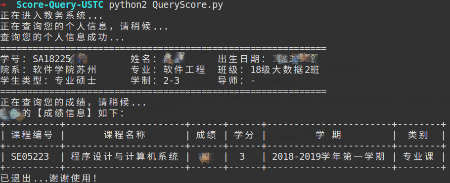

# 中科大研究生成绩查询系统

最近在看爬虫，于是想着做个成绩查询系统练习一下...分享一下  
~~已经将它部署到服务器上了，地址：[**http://ustc.cjh.zone**](http://ustc.cjh.zone)，欢迎使用~(有效！)~~

> **2019.3.28更新：**  
> 科大统一身份认证登录界面已改，所以程序运行会出问题了。。。有时间我再改改代码

## 环境依赖

我的环境： python2.7，除此之外，还需要额外安装两个库：

```bash
pip install requests
pip install prettytable # 打印表格需要
```


## 适用人员

科大研究生

> 因为使用的接口是[科大研究生信息平台](http://yjs.ustc.edu.cn/default_yjsy.asp)，所以本科生可能用不了


## 使用方法

- 将项目克隆到本地

  ```bash
  git clone https://github.com/jianhuchen/Score-Query-USTC.git
  ```

- 修改配置文件`conf.py`

  1. 账号信息

  2. 选择登录接口
     登录科大研究生平台时，有两种途径：
     - 研究生信息平台，此接口的缺点是需要手动输入验证码，但是稳定
        手动输入验证码：验证码的路径为工程的根目录
     - 科大统一身份认证，此接口的好处是不用输入验证码（所以默认使用此接口），但是个人感觉没有上面的接口稳定
       只能将上面两个接口其中一个设置为`True`
       若两个均设为`True`，则使用 科大研究生平台接口 登录
  3. 是否输出日志到文件


## 运行实例

配置好环境，设置好配置文件`conf.py`后，在项目根目录运行：

```
python QueryScore.py 
```

运行结果：



